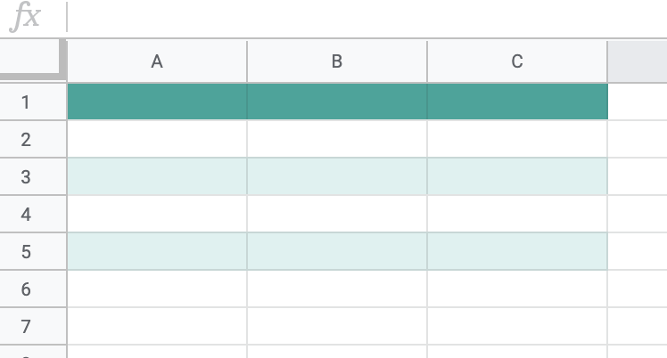
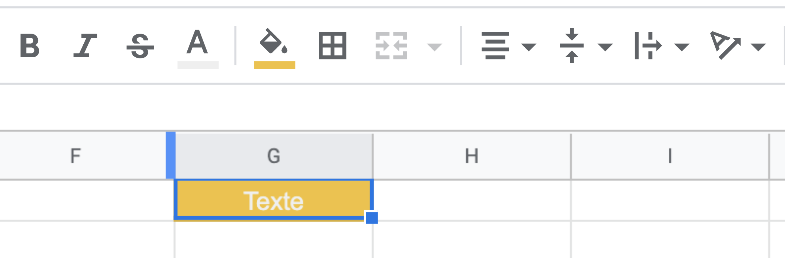

# Google Sheets
**Cours Google Sheets** - *Maitriser la puissance*

## Fonctionnalités de base

### Apparences
Un tableau peut être mis en forme de manière à rendre vos données plus lisibles.

```
Sélection du tableau puis
Format -> Couleurs en alternance
```


Des thèmes de couleurs vous sont proposés dans la colonne de droite, ainsi que la possibilité de choisir les votres.

Vous pouvez également personnaliser chaque cellule grâce à la barre d'outils située en haut du document.
